<p align="center">
  <a href="https://magicsync.dev//" target="_blank">
  <picture>
    <source media="(prefers-color-scheme: dark)" srcset="https://raw.githubusercontent.com/leamsigc/MagicSync/refs/heads/main/packages/site/public/img/logo.png">
    
  </picture>
    <h1 align="center">MagicSync</h1>
  </a>
</p>

<p align="center">
<a href="https://opensource.org/license/agpl-v3">
  
</a>
</p>

<h3 align="center"><strong><a href="https://github.com/leamsigc/MagicSync/tree/main/magic-sync-skill">
 NEW: check out MagicSync Agent Skill perfect for your N8N workflows or AI Harness</a>
 </strong></h3>
<div align="center">
  <strong>
  <h2>Not just a simple Social Media Management Platform</h2><br />
  <a href="https://magicsync.dev/">MagicSync</a>: An alternative to: 
    Buffer.com, 
    Hypefury, 
    Twitter Hunter, 
    Postiz,etc...<br /><br />
  </strong>
  MagicSync helps you manage your social media posts,<br />
  build,capture leads, grow your business
  and the most important point is: <strong>Save time</strong>.
</div>


<p align="center">
  <br />
  <a href="https://leamsigc.github.io/MagicSync/" rel="dofollow"><strong>Explore the docs »</strong></a>
  <br />

  <br />
  <a href="https://youtube.com/@leamsigc" rel="dofollow"><strong>Watch the YouTube Tutorials»</strong></a>
  <br />
</p>

<p align="center">
  <a href="https://magicsync.dev/register">Register</a>
  ·
  <a href="https://magicsync.dev/">Join Our Discord (coming soon)</a>
  ·
  <a href="https://leamsigc.github.io/MagicSync/guide/features">Public API</a><br />
</p>

<br /><br />

# MagicSync

**Social media scheduling platform built with Nuxt 4 monorepo** — Schedule posts across Facebook, Twitter/X, Instagram, Bluesky, LinkedIn, and more with AI-powered content generation.


.png)
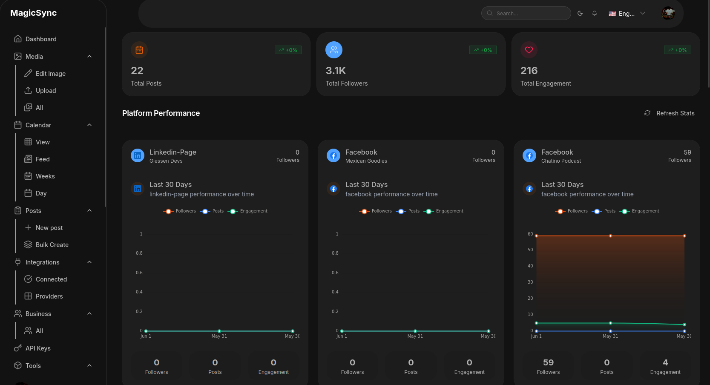
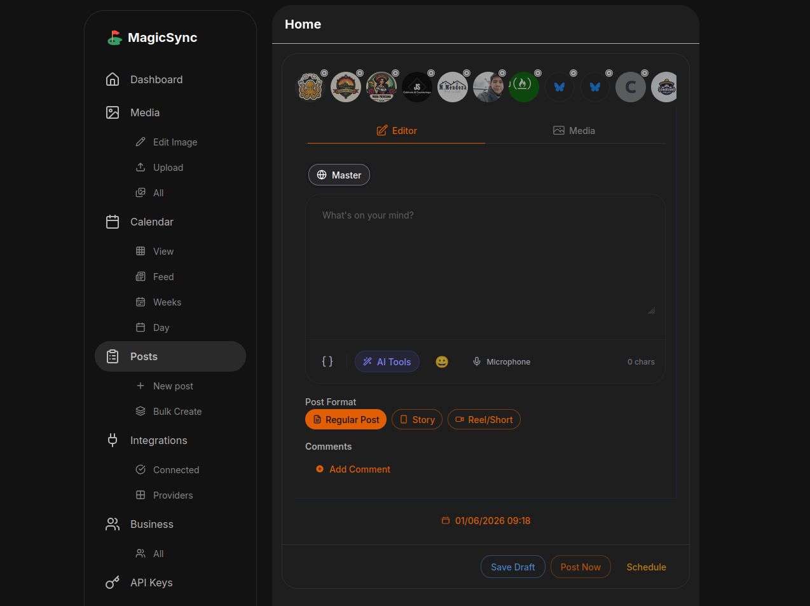
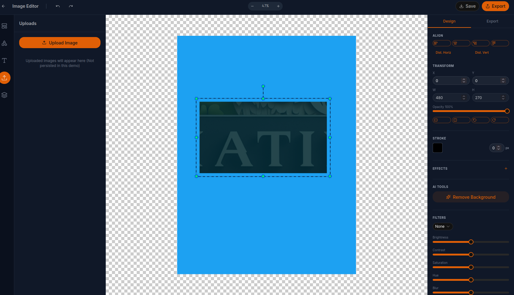
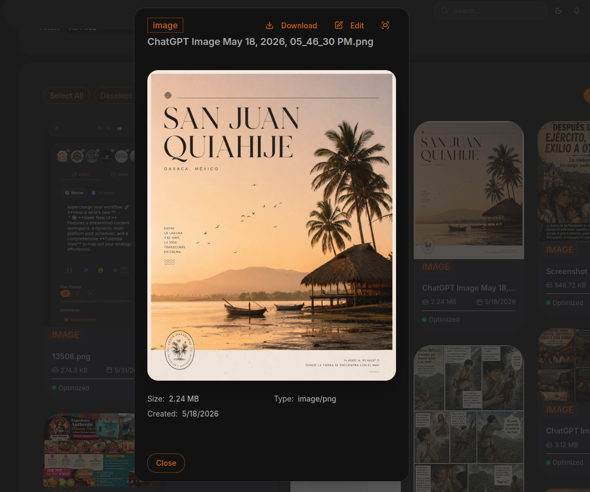
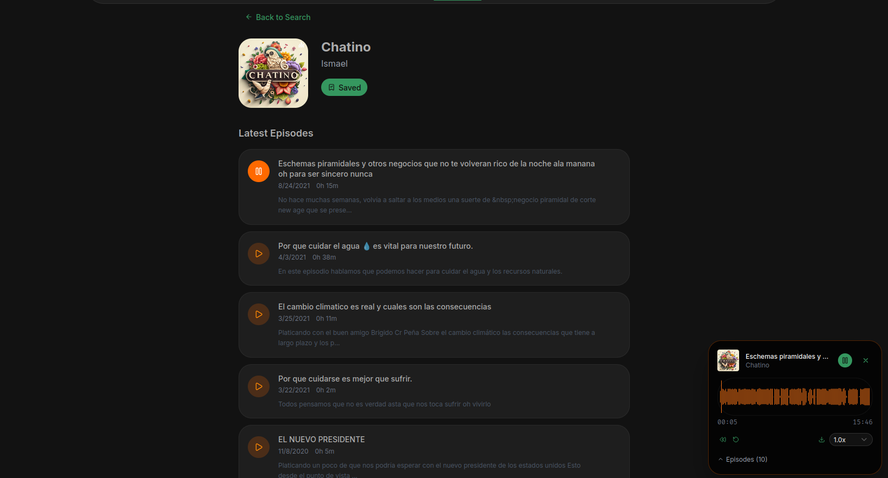
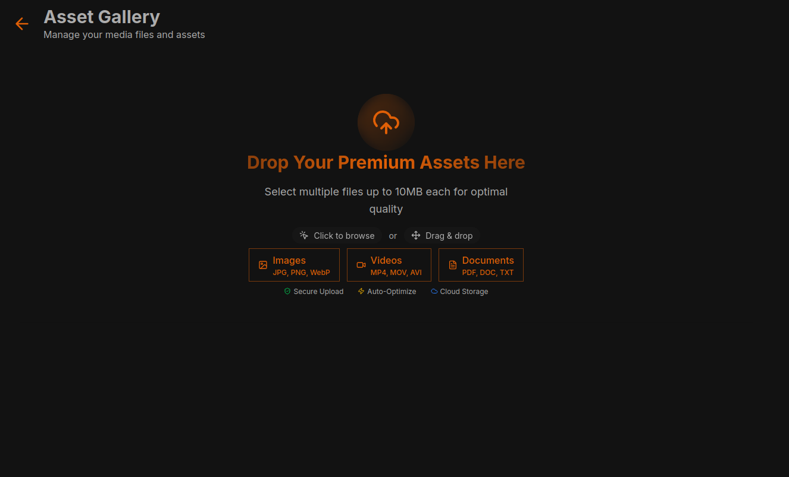
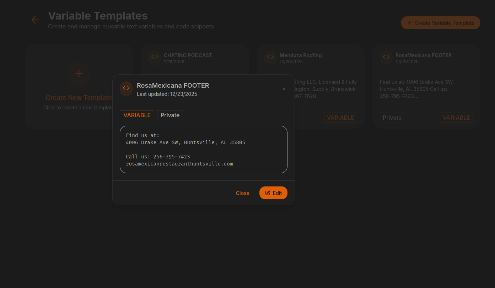
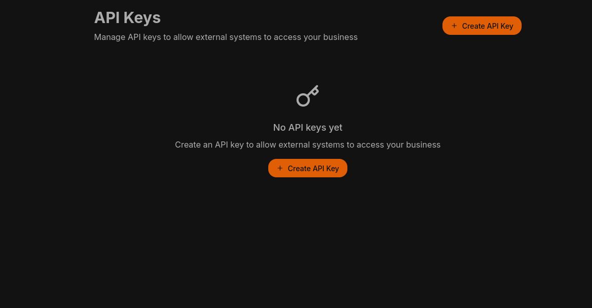
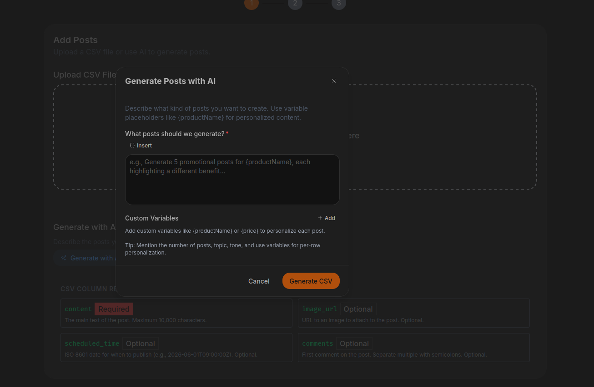
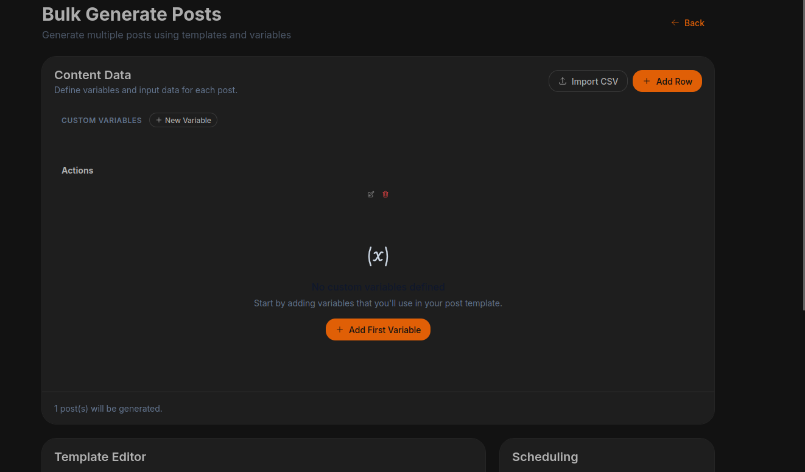
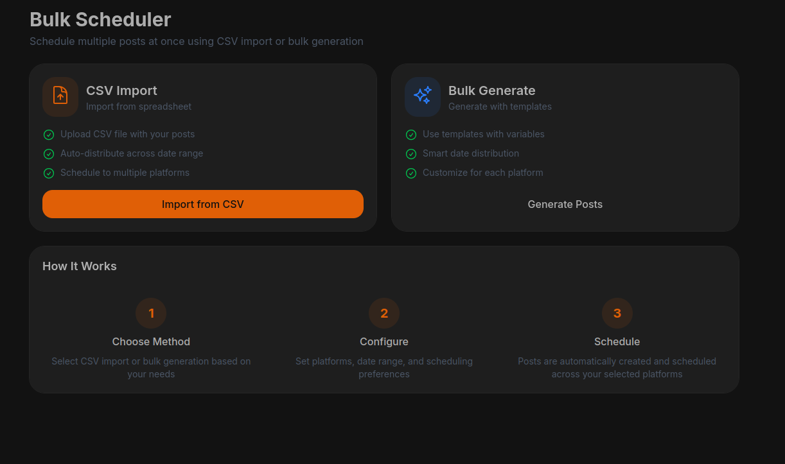
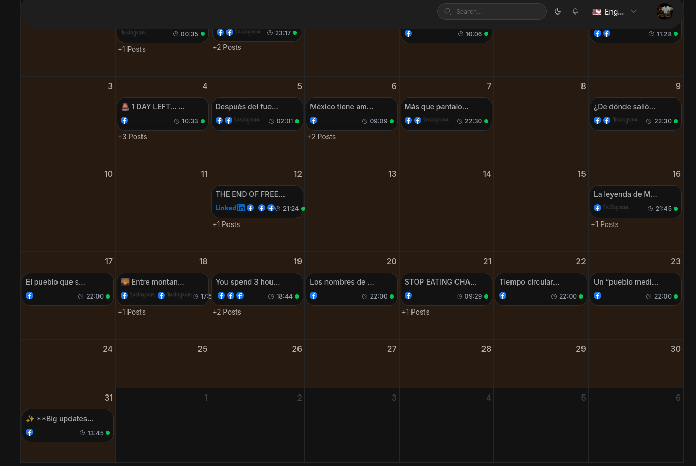
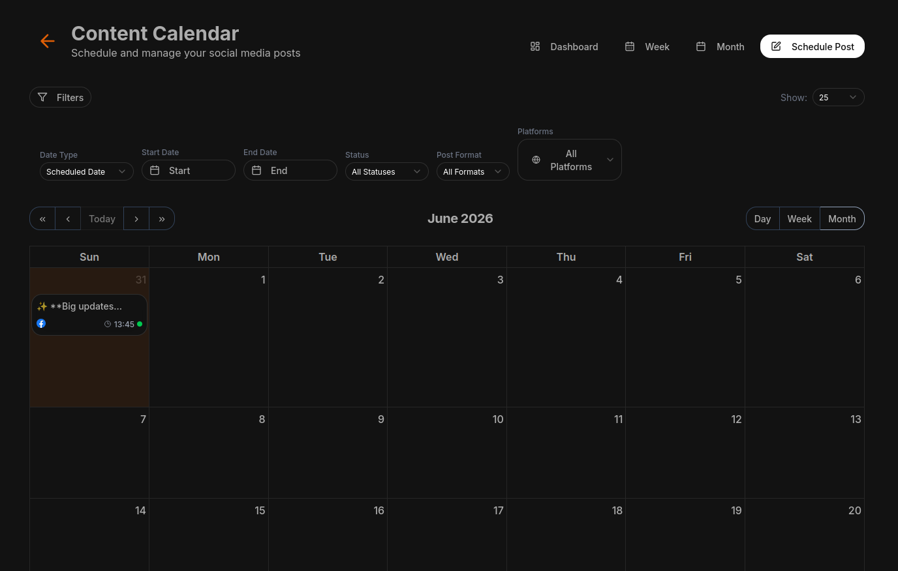
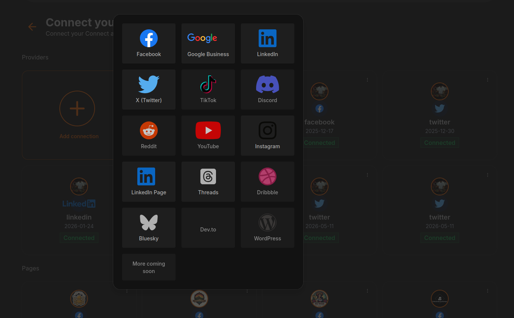
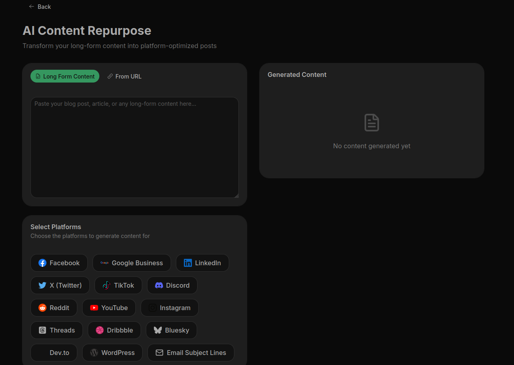
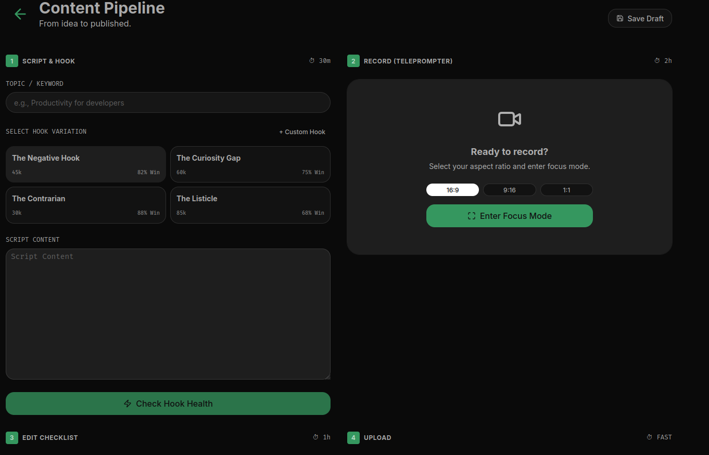

---


## What is MagicSync?

MagicSync is a comprehensive social media management platform that enables you to:

- **Connect multiple platforms** — Facebook, Twitter/X, Instagram, Bluesky, LinkedIn, TikTok, YouTube, Threads, Reddit, Dribbble, WordPress
- **Schedule posts** — Plan content with a powerful calendar view (Month, Week, Day)
- **AI-powered content generation** — Generate engaging posts using AI based on your business details
- **Bulk scheduling** — Create and schedule multiple posts at once across date ranges
- **Media management** — Upload, organize, and manage your images and videos
- **Template system** — Use variable templates and chat templates for consistent branding
- **In-browser tools** — Image editor, video silence remover, social media & email preview generators

---

## Features

### Platform Connections


Connect all your social media accounts in one place and manage them from a unified dashboard.

### Post Creation & Scheduling


Create posts once and publish to multiple platforms simultaneously. Schedule them for optimal engagement times.

### Calendar View


Visual calendar with Month, Week, and Day views. Hover on posts to preview them per platform.

### Media Management


Organize your media assets efficiently with upload, categorization, and easy access.

### AI Tools & Templates


Generate AI-powered posts, use chat templates for consistent messaging, and manage business profiles.

### Built-in Tools


- **Image Editor** — Add text overlays to images
- **Video Silence Remover** — Automatically remove silent parts from videos
- **Social Media Preview** — Preview how posts look on each platform
- **Email Preview** — Test email rendering before sending

---

## Available Skill

MagicSync comes with a specialized skill for social media management:

| Skill | Description |
|-------|-------------|
| **magic-sync** | Create, schedule, and manage social media posts across multiple platforms |

### MagicSync Skill

Use the **magic-sync** skill to:
- Create social media posts with content validation
- Schedule posts across multiple platforms (Facebook, Twitter/X, Instagram, Bluesky, LinkedIn, etc.)
- Manage existing posts
- Generate platform-specific content
- Handle media attachments (images, videos)
- Configure per-platform content overrides

**Skill triggers:** "create social media post", "schedule post", "post to twitter", "post to instagram", "post to facebook", "post to bluesky", "post to linkedin", "social media", "cross-post"

---

## Tech Stack

| Layer | Technology |
|-------|------------|
| Frontend | Nuxt 4, Vue 3, @nuxt/ui |
| Backend | Nuxt Server Routes, Better Auth |
| Database | Turso (libSQL) with native vector support |
| AI | LLM integration for content generation |
| Python Backend | FastAPI (optional, port 8000) |

---

## Project Structure

```
packages/
├── db/          # Database layer (Drizzle ORM, Turso)
├── auth/        # Authentication (Better Auth)
├── assets/      # Media upload & management
├── scheduler/   # Post scheduling & calendar
├── connect/     # Social platform connections
├── tools/       # In-browser tools (image editor, etc.)
├── ai-tools/    # AI content generation
├── bulk-scheduler/  # Bulk post creation & scheduling
├── content/     # Static content & blog
├── ui/          # Base UI components (@nuxt/ui wrappers)
├── email/       # Email templates & service
├── site/        # Main application (layer merge point)
```

---

## Quick Start

```bash
# Install dependencies
pnpm install

# Set up environment
cp .env-example .env
# Edit .env with your API keys

# Initialize database
cd packages/db && pnpm db:generate && pnpm db:migrate

# Start development
pnpm site:dev
```

---

## Commands

| Command | Description |
|---------|-------------|
| `pnpm site:dev` | Start dev server (port 3000) |
| `pnpm build` | Build all packages |
| `pnpm site:build` | Build main site |
| `pnpm ui:lint` | Lint UI components |
| `cd packages/db && pnpm db:generate` | Generate database schema |
| `cd python-backend && pnpm dev` | Start FastAPI backend (port 8000) |

---

## Currently Working

- User registration and login
- Assets management
- Tools (Image Editor, Video Silence Remover)
- Platform connections (Google, Facebook, Twitter, Instagram, Bluesky, LinkedIn, etc.)
- Post creation with multi-platform targeting
- Calendar view (Month, Week, Day)
- Hover preview on scheduled posts
- Chat templates & variable templates
- Business profile management

---

## Follow the Journey

[](https://www.facebook.com/MagicSyncdordev)
[](https://www.instagram.com/magicsyncdotdev/)
[](https://twitter.com/magicsyncdotdev)
[](https://www.linkedin.com/in/magicsyncdotdev/)

---

## License

MIT


---

## Other Projects

<div align="center" style="display: grid; grid-template-columns: repeat(auto-fit, minmax(300px, 1fr)); gap: 20px; padding: 20px;">


<a href="https://roofingmendoza.com" target="_blank" style="border: 1px solid #ddd; border-radius: 8px; padding: 16px; text-decoration: none; color: inherit;">

<h3>Roofing Mendoza LLC</h3>
<p>MASTERING THE ART OF ROOFING Specializing in Residential and Commercial projects in Wilmington, Supply, and Brunswick County.</p>
</a>

<a href="https://human-ideas.giessen.dev/tools/text-behind-image" target="_blank" style="border: 1px solid #ddd; border-radius: 8px; padding: 16px; text-decoration: none; color: inherit;">

<h3>Text behind the image</h3>
<p>Save 10+ hours every week managing social media. Schedule posts, engage customers, and track results across all platforms—without the hassle or high costs.</p>
</a>

<a href="https://mexican-goodies.com" target="_blank" style="border: 1px solid #ddd; border-radius: 8px; padding: 16px; text-decoration: none; color: inherit;">

<h3>Mexican Goodies</h3>
<p>The curated ecosystem of Mexican Business in Europe. Connect.Grow.Thrive.</p>
</a>

<a href="https://magicsync.dev" target="_blank" style="border: 1px solid #ddd; border-radius: 8px; padding: 16px; text-decoration: none; color: inherit;">

<h3>Magic Sync</h3>
<p>Save 10+ hours every week managing social media. Schedule posts, engage customers, and track results across all platforms—without the hassle or high costs.</p>
</a>

<a href="https://must-know-resources-for-programmers.giessen.dev" target="_blank" style="border: 1px solid #ddd; border-radius: 8px; padding: 16px; text-decoration: none; color: inherit;">

<h3>Must Know Resources for Programmers</h3>
<p>Level up your computer science skills with our curated list of top websites for tips, tools, and insights. Got a favorite? Share it and grow our CS resource hub</p>
</a>

<a href="https://human-ideas.giessen.dev" target="_blank" style="border: 1px solid #ddd; border-radius: 8px; padding: 16px; text-decoration: none; color: inherit;">

<h3>Human Ideas</h3>
<p>Explore the best ideas created by humans, here you can find some good ideas for your next side project, or for your startup. but most of the ideas that you will find here are not the best as we are humans so don't expect too much</p>
</a>

<a href="https://must-know-resources-for-programmers.giessen.dev/saas-starter-kits" target="_blank" style="border: 1px solid #ddd; border-radius: 8px; padding: 16px; text-decoration: none; color: inherit;">

<h3>Saas Starter Kits</h3>
<p>Kickstart your SaaS journey with our curated directory of top open-source and premium starter kits. Find the tools you need to launch fast and efficiently. Have a favorite kit? Share it and contribute to our growing resource hub!</p>
</a>

<a href="https://leamsigc.com" target="_blank" style="border: 1px solid #ddd; border-radius: 8px; padding: 16px; text-decoration: none; color: inherit;">

<h3>Leamsigc</h3>
<p>The personal website of Ismael Garcia</p>
</a>

<a href="https://leamsigc.com" target="_blank" style="border: 1px solid #ddd; border-radius: 8px; padding: 16px; text-decoration: none; color: inherit;">

<h3>Leamsigc</h3>
<p>The personal website of Ismael Garcia</p>
</a>

</div>

---
