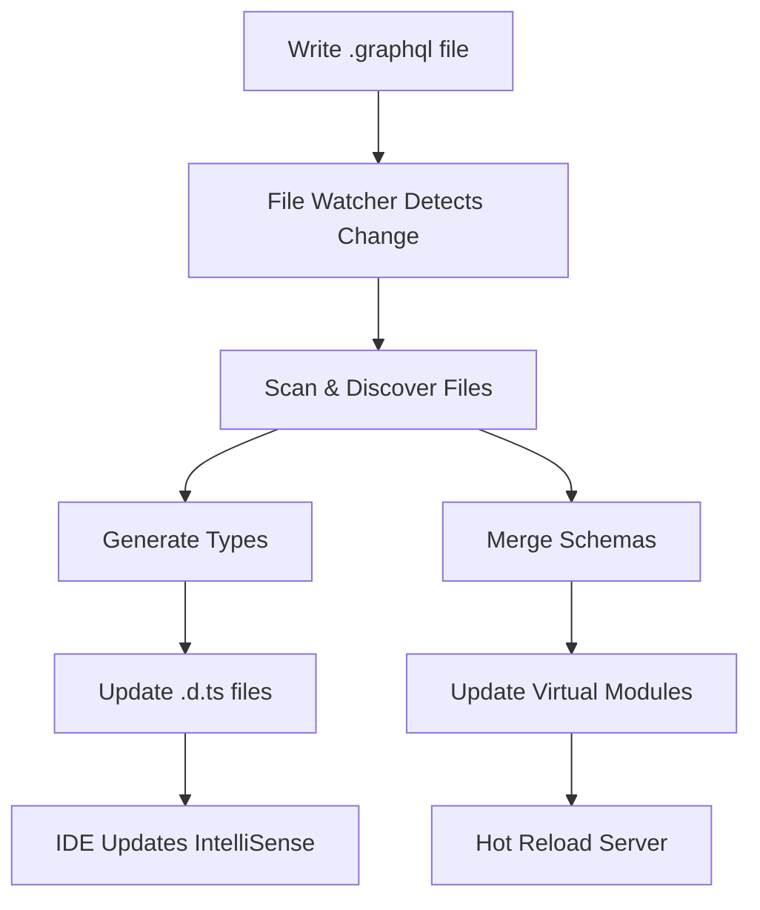
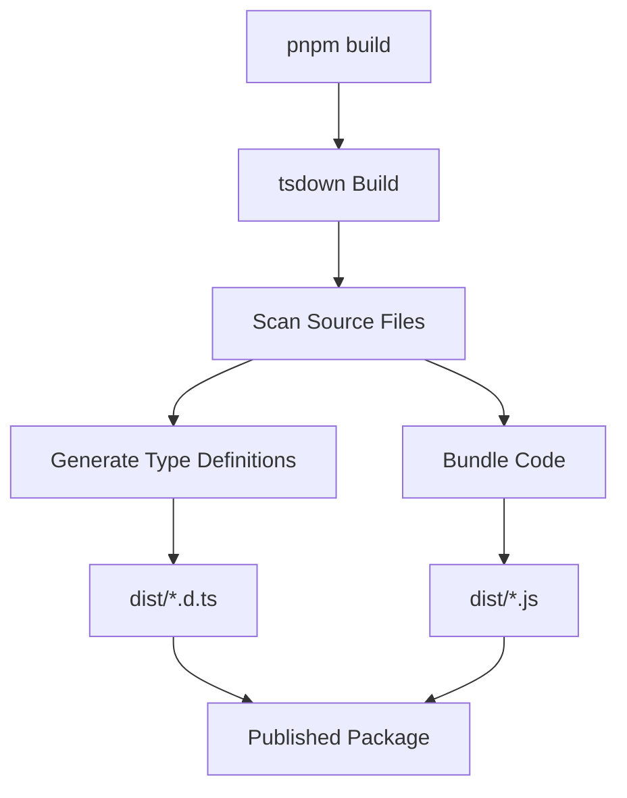
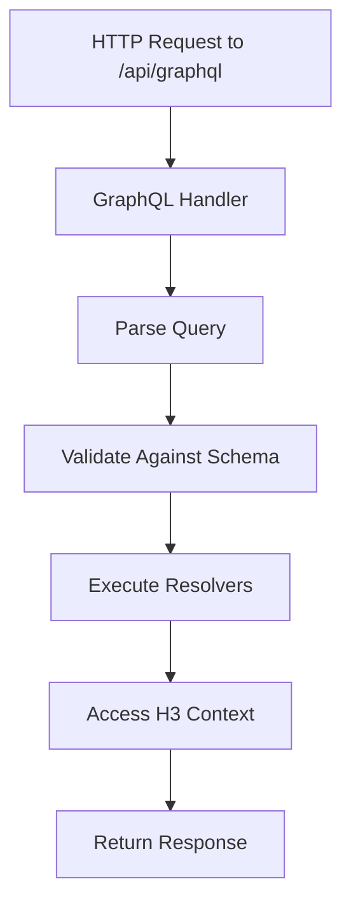

# Architecture

<FunctionInfo fn="architecture"/>

This guide provides a deep dive into the Nitro GraphQL architecture, helping you understand how the module works internally.

## Overview

Nitro GraphQL is built as a Nitro module that orchestrates:
1. **File Discovery** - Auto-discovering GraphQL schemas and resolvers
2. **Schema Merging** - Combining multiple schema files into one
3. **Resolver Loading** - Loading and registering resolver functions
4. **Type Generation** - Generating TypeScript types from schemas
5. **Runtime Serving** - Setting up GraphQL endpoints

## Core Components

### 1. Main Module Entry (`src/index.ts`)

The heart of the module that orchestrates everything:

```typescript
// Simplified structure
export default defineNitroModule({
  setup(nitro, options) {
    // 1. Setup file watching
    // 2. Scan and discover files
    // 3. Generate types
    // 4. Register routes
    // 5. Handle Nuxt integration
  }
})
```

**Key Responsibilities:**
- Nitro module definition and registration
- File watching setup (development mode)
- Code generation orchestration
- Route registration (`/api/graphql`, `/api/graphql-health`)
- Nuxt layer-aware directory scanning
- Virtual module setup

**Important Functions:**
- `setupFileWatching()` - Watches for schema/resolver changes
- `generateTypes()` - Triggers type generation
- `registerRoutes()` - Sets up GraphQL endpoints

### 2. Code Generation System

#### Type Generation Orchestrator (`src/utils/type-generation.ts`)

Coordinates all type generation:

```typescript
export async function generateTypes(options) {
  // 1. Generate server types from schemas
  await generateServerTypes()

  // 2. Generate client types from queries/mutations
  await generateClientTypes()

  // 3. Generate types for external services
  await generateExternalServiceTypes()
}
```

**Responsibilities:**
- Orchestrates server and client type generation
- Manages external service type generation
- Handles file paths and output locations
- Coordinates with path resolver for v2.0+ features

#### Server Type Generation (`src/utils/server-codegen.ts`)

Generates TypeScript types from GraphQL schemas:

```typescript
// Generated types available as:
import type { Mutation, Query, User } from '#graphql/server'
```

**Process:**
1. Load all GraphQL schema files
2. Merge schemas using `@graphql-tools`
3. Use `@graphql-codegen` to generate resolver types
4. Output to `.nitro/types/nitro-graphql-server.d.ts`

**Key Tools:**
- `@graphql-tools/merge` - Schema merging
- `@graphql-codegen/typescript` - Type generation
- `@graphql-codegen/typescript-resolvers` - Resolver types

#### Client Type Generation (`src/utils/client-codegen.ts`)

Generates types for client-side queries and mutations:

```typescript
// Generated types available as:
import type { GetUserQuery, GetUserQueryVariables } from '#graphql/client'
```

**Process:**
1. Scan for `.graphql` files in client directories
2. Load GraphQL operations (queries/mutations)
3. Generate operation types
4. Output to `.nitro/types/nitro-graphql-client.d.ts`

**Key Features:**
- Operation-specific types
- Variables type generation
- External service support
- SDK generation (optional)

### 3. File Scanning & Discovery (`src/utils/index.ts`)

Automatically discovers GraphQL files in your project:

```typescript
// Core scanning functions
export function scanSchemas(baseDir: string): string[]
export function scanResolvers(baseDir: string): string[]
export function scanDirectives(baseDir: string): string[]
export function scanDocs(baseDir: string): string[]
```

**Discovery Patterns:**
- Schemas: `server/graphql/**/*.graphql`
- Resolvers: `server/graphql/**/*.resolver.ts`
- Client queries: `graphql/**/*.graphql` (Nitro) or `app/graphql/**/*.graphql` (Nuxt)
- Directives: `server/graphql/**/*.directive.ts`

**Nuxt Layer Support:**
All scanning functions are layer-aware, automatically discovering files across:
- Base application
- Nuxt layers
- Extended layers

### 4. Runtime Routes

#### GraphQL Yoga Handler (`src/routes/graphql-yoga.ts`)

The default GraphQL server implementation:

```typescript
import { createYoga } from 'graphql-yoga'
import { defineEventHandler } from 'nitro/h3'

export default defineEventHandler(async (event) => {
  const yoga = createYoga({
    schema: loadedSchema,
    // ... configuration
  })

  return yoga.handle(event)
})
```

**Features:**
- H3 event integration
- Context from H3 event
- GraphiQL interface
- WebSocket support (subscriptions)

#### Apollo Server Handler (`src/routes/apollo-server.ts`)

**Features:**
- Apollo Federation support
- Plugin ecosystem
- Advanced caching
- Apollo Studio integration

#### Health Check (`src/routes/health.ts`)

Simple health check endpoint at `/api/graphql-health`:

```typescript
export default defineEventHandler(() => ({
  status: 'ok',
  timestamp: Date.now()
}))
```

### 5. Utility Functions (`src/utils/define.ts`)

Type-safe resolver definition helpers:

```typescript
// Define complete resolvers (Query + Mutation + Types)
export function defineResolver(resolvers: Resolvers): Resolvers

// Define query-only resolvers
export function defineQuery(query: QueryResolvers): Resolvers

// Define mutation-only resolvers
export function defineMutation(mutation: MutationResolvers): Resolvers

// Define custom type resolvers
export function defineField<T>(type: T): T

// Define custom directives
export function defineDirective(directive: DirectiveConfig): DirectiveConfig

// Define GraphQL server configuration
export function defineGraphQLConfig(config: GraphQLConfig): GraphQLConfig

// Define schema extensions
export function defineSchema(schema: string): string
```

**Auto-imports:**
These utilities are automatically available in `.resolver.ts` files without explicit imports.

### 6. Path Resolution System (v2.0+)

#### Path Resolver (`src/utils/path-resolver.ts`)

Handles all path resolution with configuration support:

```typescript
export function resolveScaffoldPaths(options): ScaffoldPaths
export function resolveClientUtilsPaths(options): ClientUtilsPaths
export function resolveSdkPaths(options): SdkPaths
export function resolveTypePaths(options): TypePaths
```

**Features:**
- Placeholder replacement (`{serviceName}`, `{buildDir}`, etc.)
- Path overrides from configuration
- Framework-specific defaults
- Service-specific paths

#### File Generator (`src/utils/file-generator.ts`)

Handles file generation with control options:

```typescript
export async function generateScaffoldFiles(options)
export async function generateClientUtils(options)
export async function generateSdkFiles(options)
export async function generateTypeFiles(options)
```

**Control Flags:**
- `scaffold: false` - Disable scaffold file generation
- `clientUtils: false` - Disable client utilities
- `sdk: false` - Disable SDK generation
- `types: false` - Disable type generation

### 7. Apollo Integration (`src/utils/apollo.ts`)

Apollo-specific utilities:

```typescript
// Build Apollo Federation subgraph
export function buildSubgraphSchema(options): GraphQLSchema

// Federation types and utilities
export type { FederationOptions, SubgraphConfig }
```

**Features:**
- Federation subgraph setup
- Entity resolvers
- Reference resolvers
- Federation directives

### 8. Virtual Modules

Nitro GraphQL uses virtual modules for runtime code injection:

```typescript
import config from '#nitro-internal-virtual/graphql-config'
import directives from '#nitro-internal-virtual/server-directives'
import resolvers from '#nitro-internal-virtual/server-resolvers'
// Virtual imports (not actual files)
import schemas from '#nitro-internal-virtual/server-schemas'
```

**Implementation:**
- `src/virtual/` - Virtual module implementations
- Rollup plugin injects code at build time
- No actual files on disk

## Data Flow

### Development Flow



### Build Flow



### Runtime Flow



## Module Lifecycle

### Initialization (Build Time)

1. **Module Setup** (`src/index.ts`)
   - Register with Nitro
   - Read configuration options
   - Set up virtual modules

2. **File Discovery**
   - Scan for schemas
   - Scan for resolvers
   - Scan for directives
   - Scan for client queries (Nuxt only)

3. **Code Generation**
   - Generate server types
   - Generate client types
   - Generate scaffold files
   - Generate SDK files

4. **Route Registration**
   - Register GraphQL endpoint
   - Register health check
   - Set up middleware

### Runtime (Request Time)

1. **Request Arrives** at `/api/graphql`

2. **Handler Execution**
   - GraphQL Yoga or Apollo Server handles request
   - Parse and validate query
   - Execute resolvers

3. **Context Access**
   - H3 event available in resolver context
   - Access request headers, cookies, etc.
   - Access Nitro storage, cache, etc.

4. **Response** returned to client

## Build System

### tsdown Configuration (`tsdown.config.ts`)

The module uses `tsdown` for building:

```typescript
export default defineConfig({
  entry: [
    'src/index.ts',
    'src/codegen.ts',
    'src/utils/**',
    'src/routes/**',
    // ... more entry points
  ],
  format: ['esm'],
  dts: true, // Generate .d.ts files
  clean: true, // Clean dist before build
  unbundle: true, // Don't bundle dependencies
  external: [
    // External dependencies that shouldn't be bundled
    'nitropack',
    'graphql',
    'nitro/h3',
    // ...
  ]
})
```

**Key Configuration:**
- **Multiple Entry Points** - Separate exports for different functionality
- **ESM Only** - Modern JavaScript modules
- **Unbundled** - Dependencies are peer/regular dependencies
- **Type Declarations** - Full TypeScript support

### Package Exports (`package.json`)

The module exports multiple subpaths:

```json
{
  "exports": {
    ".": "./dist/index.js",
    "./codegen": "./dist/codegen.js",
    "./watcher": "./dist/watcher.js",
    "./context": "./dist/context.js",
    "./utils": "./dist/utils/index.js",
    "./utils/define": "./dist/utils/define.js",
    "./utils/apollo": "./dist/utils/apollo.js",
    "./nuxt": "./dist/ecosystem/nuxt.js"
  }
}
```

**Usage:**
```typescript
import nitroGraphQL from 'nitro-graphql'
import { buildSubgraphSchema } from 'nitro-graphql/utils/apollo'
import { defineResolver } from 'nitro-graphql/define'
```

## Key Concepts

### Named Exports Required

All resolvers MUST use named exports (not default exports):

```typescript
// ✅ Correct - Named export
export const userQueries = defineQuery({
  user: () => { /* ... */ }
})

// ❌ Wrong - Default export (deprecated)
export default defineQuery({
  user: () => { /* ... */ }
})
```

**Reason:** Named exports allow better tree-shaking and clearer imports.

### Context Typing

Extend H3 context in `server/graphql/context.ts`:

```typescript
declare module 'nitro/h3' {
  interface H3EventContext {
    user?: User
    session?: Session
  }
}
```

Access in resolvers:

```typescript
export const userQueries = defineQuery({
  me: async (_, __, context) => {
    // context is H3EventContext
    const user = context.user
    return user
  }
})
```

### Virtual Imports

Type-only imports for generated types:

```typescript
// Client types (never bundled, type-only)
import type { GetUserQuery } from '#graphql/client'

// Server types (never bundled, type-only)
import type { Mutation, Query } from '#graphql/server'
```

## Extension Points

### Adding a New Framework

To add support for a new GraphQL framework:

1. Create route handler in `src/routes/your-framework.ts`
2. Add configuration option in `src/types/index.ts`
3. Update main module to handle the new option
4. Add documentation

### Adding New Code Generation

To add new code generation capabilities:

1. Create generator function in `src/utils/your-codegen.ts`
2. Hook into type generation orchestrator
3. Add configuration options
4. Update path resolver if needed

### Adding New Virtual Modules

To add new virtual modules:

1. Create implementation in `src/virtual/your-module.ts`
2. Register in rollup plugin (`src/rollup.ts`)
3. Add TypeScript definitions in `src/virtual.d.ts`

## Performance Considerations

### File Watching

- Uses `chokidar` for efficient file watching
- Debounced to avoid excessive rebuilds
- Only watches relevant directories

### Type Generation

- Cached based on file hashes
- Only regenerates when schemas change
- Parallel generation for multiple services

### Schema Merging

- Lazy loaded at runtime
- Cached after first merge
- Efficient with `@graphql-tools`

## Next Steps

- Learn about [Adding Features](/contributing/adding-features)
- Understand the [Development Setup](/contributing/development-setup)
- Contribute to [Documentation](/contributing/documentation)

---

## Source
<SourceLinks fn="architecture"/>

## Contributors
<Contributors fn="architecture"/>

## Changelog
<Changelog fn="architecture"/>
