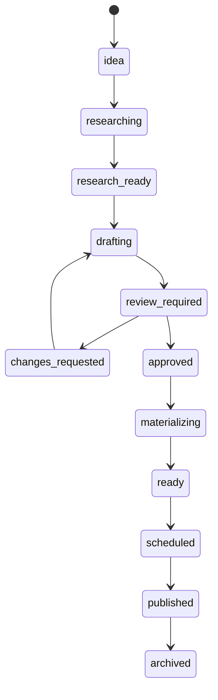

# Content Board

Every business has a kanban board where ideas become reviewed, approved, and delivered content.

Open it from **Businesses → your business → Content board**, or directly at `/app/business/<id>/content`. The board is also linked from the Brand Playbook flow and the dashboard quick actions.

---

## Columns and States

The seven board columns map onto thirteen item states:



| Column | States |
|---|---|
| Ideas | `idea` |
| Research | `researching`, `research_ready` |
| Drafting | `drafting`, `changes_requested` |
| Review | `review_required` |
| Approved | `approved`, `materializing`, `ready` |
| Delivery | `scheduled`, `published` |
| Archive | `archived`, `failed` |

Every move is append-only audited in `content_item_events` (who, from → to, payload), so the card detail drawer shows a full timeline.

---

## Card Actions

Select a card to open its drawer. Available actions depend on the state:

| Action | Effect |
|---|---|
| **Start research** | Moves the card into research |
| **Generate draft** | Runs the full content chain (research → write → humanize → checks) |
| **Submit for review** | Parks a draft at `review_required` |
| **Request changes** | Sends it back to drafting; the next *Generate* resumes at drafting without repeating research |
| **Approve** | Requires an approved artifact version; agents can never do this |
| **Materialize** | Turns the approved artifact into a post/carousel/reel draft |
| **Schedule** | Schedules through the scheduler (requires an approved artifact and connected accounts) |
| **Publish** | Queues a publishing job (GitHub / WordPress) |
| **Archive** | Removes it from the active flow |

Cards also deep-link into chat ("Work in chat") so you can ask the agent to work on that specific item.

---

## The Content Chain

*Generate draft* runs a deterministic chain, recording a `content_runs` row per step:

```text
research_topic → write_post → humanize → check_seo / check_geo / check_links → review
```

- **Research** is grounded in the Brand Playbook and citations.
- **Write** produces a caption, platform variants, CTA, claims, and sources.
- **Humanize** rewrites for natural tone while preserving every claim verbatim.
- **Checks** score SEO (length, CTA, hashtags, topic coverage), GEO readiness (question-led, data, citations), and link health. Findings land in `content_checks`.
- **Review** submits an artifact through the artifact service and moves the card to `review_required`.

Nothing is scheduled or published by the chain.

---

## Trend Scans

Ask the chat to run a trend scan (or trigger the workflow), and the agent:

1. Ranks the business's best-performing posts (`scan_trends`).
2. Proposes 3–8 fresh angles with sources.
3. Adds them to the board as `idea` cards (`board_add_cards`, source type `trend`).

Trend scan executions are recorded in `content_runs` with the `trend_scan` step.

---

## Quick Actions and Batch

Use **Batch ideas** on the board to generate placeholder cards in one go:

| Kind | What it creates |
|---|---|
| Days | N daily post ideas (`days`, max 31) |
| Carousel | N carousel ideas |
| Reel | N reel storyboard ideas |
| Repurpose | N repurpose ideas |

Batch cards are created in `idea` state and are never published automatically.

The board also shows an **Agent activity** feed: recent `agent_runs` with status, duration, and token usage.

---

## Approval Gates

External side effects require a human-approved artifact version:

- `review_required → approved` needs an approved artifact (submitted and reviewed through the artifact service).
- `materializing → ready` requires a linked artifact.
- `scheduled` / `published` require an approved artifact; publishing always goes through `publishingService` jobs.

This means agents can draft and research all day, but a person always owns the publish button.

---

## Next Steps

- [Agent Platform](/guide/agent-platform) — chat, tools, RAG, PII, limits
- [Tool Backends](/guide/tool-backends) — ScrapeGraphAI and Python tools
- [Growth Strategy & Content Pipeline](/guide/growth-strategy) — the planning methodology behind the board
